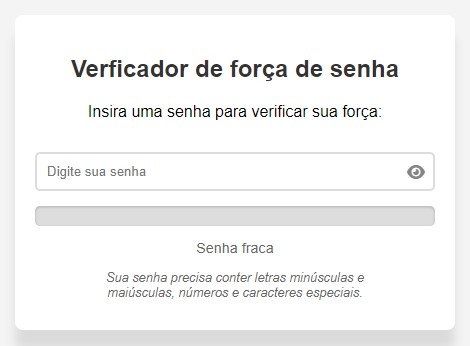

# Verificador de força de senha

Verifica a força da senha através de regras como:

- Conter letras minúsculas
- Conter letras maiúsculas
- Conter números
- Conter caracteres especiais.

## Tecnologias utilizadas

- HTML
- CSS
- JavaScript

### Interface

